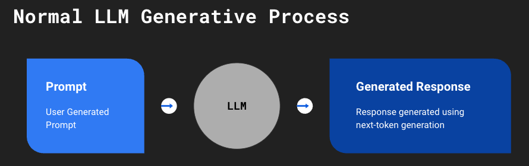
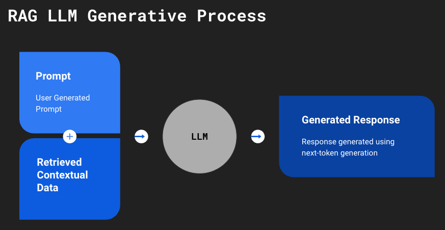

# LangChain-RAG

## Overview
In this repo I will examine Retrieval-Augmented Generation (RAG), and its ability to increase the accuracy and detail of a small LLM, including reducing hallucinations, without any fine-tuning.

The base model we'll use will be `google/flan-t5-base` but this can be changed in `configs/base/parameters.yaml`

## How to use

### Installing requirements

install requirements by running:

```
pip install -r requirements.txt
```

### Importing and initializing models


```python
from hydra import initialize, compose
from src.models import BaseModel, RagModel

with initialize(version_base=None, config_path="configs/base"):
    cfg = compose(config_name="parameters")
    base_model = BaseModel(model_name=cfg.get("model_name"))
    rag_model = RagModel(
        model_name=cfg.get("model_name"),
        chunk_size=cfg.get("rag_chunk_size"),
        chunk_overlap=cfg.get("rag_chunk_overlap")
    )
```


## RAG Overview

### What is RAG?
Retrieval-Augmented Generation (RAG) is one of the many processes of optimizing a large language model (LLM), other approaches include prompt engineering, prompt tuning, and fine-tuning.  Two particularly important use-cases of RAG are:
1) Preventing the presentation of false information, also known as hallucinations
2) Updating the knowledge base of the model without having to retrain the data or filter out the outdated data

### How does RAG work?

##### Overview of traditional LLM's



With a traditional LLM, the prompt is passed to a pre-trained model and, using next-token generation, the model provides a response to the prompt.  

This can lead to a couple of issues, because the model is simply predicting the next-likeliest token it can make it incredibly likely for the model to make up an answer if it doesn't already have it stored. It also means that whatever answer it does provide will be based upon what was most prevalent in its training data. So if the model's training data didn't include either domain specific text or newer more relevant text, the answer you get will most likely be wrong or outdated.

##### Overview of RAG



In contrast, an LLM with RAG, the prompt along with contextual data relevant to the question is provided to a pre-trained model, this then helps the model with its next-token generation.  

While not an apple to apple comparison, one way I like to think about this change is it turns the question (prompt) from an essay into reading comprehension.

When comparing the following questions its obvious that one of the questions is quite easier to answer:
1) Who was the Prime Minister of the UK in 1849?
2) Given the context: "John Russell was a British Whig and Liberal statesman who served as Prime Minister of the United Kingdom from 1846 to 1852 and again from 1865 to 1866." Who was the Prime Minister of the UK in 1849?


```python
question = "What movies is Jason Bateman known for?"

base_model_answer = base_model.chat(question)
rag_model_answer = rag_model.chat(question)
```


```python
print(f"Normal LLM answer: {base_model_answer}")
print(f"RAG model answer: {rag_model_answer}")
```

    Normal LLM answer: The Dark Knight
    RAG model answer: Extract


We can see from this answer that the base model had a hallucination and responded that Jason Bateman was in _The Dark Night_ (he wasn't), the RAG model answered that he was known for the movie _Extract_ which he was in, and [Wikipedia](https://en.wikipedia.org/wiki/Jason_Bateman#:~:text=Bateman%20took%20starring%20roles%20in%20the%20comedies%20Extract%20(2009)) says was his first starring role.

Let's try another question


```python
base_model.new_topic()
rag_model.new_topic()
question = "Who is Taylor Swift?"
base_model_answer = base_model.chat(question)
rag_model_answer = rag_model.chat(question)
```


```python
print(f"Normal LLM answer: {base_model_answer}")
print(f"RAG model answer: {rag_model_answer}")
```

    Normal LLM answer: taylor swift
    RAG model answer: Taylor Swift is an American singer.


Here we can see that another problem with smaller LLM's, the base model just reiterates that Taylor Swift is in fact taylor swift, whereas the RAG model successfully answers that she is an American singer.
